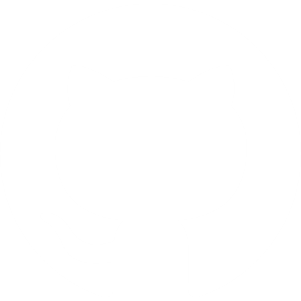

# 😸 Hello World, mi nombre es Nicolas

### Freelance Discord Developer & Content Creator

Soy desarrollador de software y automatizaciones desde 2024, con un enfoque centrado en crear herramientas útiles, interfaces sencillas y soluciones que simplifiquen tareas repetitivas.

He desarrollado distintos proyectos relacionados con el ecosistema de Discord, desde la creación y administración de comunidades hasta el desarrollo de bots personalizados y sistemas de automatización. En cada proyecto procuro aplicar buenas prácticas y mantener un enfoque profesional, priorizando la calidad, la organización y la experiencia del usuario.

Además, soy creador de contenido en múltiples plataformas, donde comparto cursos y recursos completamente gratuitos sobre programación, Discord y otras tecnologías. Mi objetivo es hacer que el aprendizaje sea más accesible, reduciendo la barrera de entrada para quienes comienzan en el mundo del desarrollo de software.

Creo que la informática no debería ser un camino complicado por la falta de recursos o documentación clara. Por eso trabajo para crear herramientas, contenido y proyectos que ayuden a la comunidad a aprender, construir y crecer de una forma más sencilla.

# 🚀 Te presento mi proyecto más ambicioso hasta la fecha

Uno de mis principales objetivos siempre ha sido ofrecer la mayor cantidad posible de contenido gratuito a la comunidad. Sin embargo, crear recursos de calidad requiere una gran inversión de tiempo y esfuerzo, por lo que nace **Nizolax Pro**.

**Nizolax Pro** es una plataforma que actualmente se encuentra en una fase temprana de desarrollo y que busca ofrecer una experiencia de aprendizaje mucho más completa que la disponible en mis redes sociales. Además de cursos más avanzados, incluirá ejercicios prácticos, proyectos reales, retos, seguimiento del progreso y asesoría personal para ayudarte a aprender de una forma más efectiva.

Mi objetivo no es simplemente publicar cursos, sino crear un entorno donde puedas desarrollar habilidades aplicándolas en proyectos reales y contando con recursos que te acompañen durante todo el proceso de aprendizaje.

Si quieres formar parte de este proyecto desde el principio, **el 10 de diciembre de 2026** se abrirá el primer acceso anticipado de **Nizolax Pro**. Todos los usuarios podrán disfrutar de una **prueba gratuita de 7 días**, con acceso al contenido disponible en ese momento para descubrir la plataforma y decidir si es el lugar adecuado para continuar su aprendizaje.
obar la veracidad y facilidad de uso de este.

---

<h3>Te invito a conocerme mejor en mis redes sociales</h3>

 

---

## Proyectos de la comunidad

### Curso de Discord Basics

### Curso de Discord Advanced

### Curso de Discord.js

### Curso de Discord.py 